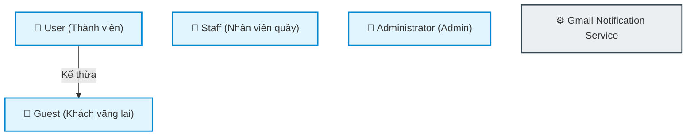

# Hướng Dẫn Vẽ Sơ Đồ Use Case Dự Án GoTrainVN (44 Use Cases)

Tài liệu này cung cấp hướng dẫn chi tiết cách thiết kế và vẽ sơ đồ Use Case cho dự án **GoTrainVN** dựa trên danh sách 44 Use Cases (từ UC-01 đến UC-44) được phân loại theo các tác nhân: **Guest**, **User**, **Staff**, và **Admin**.

---

## I. Phân Tích Tác Nhân (Actors) & Mối Quan Hệ Kế Thừa

Trong hệ thống GoTrainVN, chúng ta có 4 tác nhân chính là con người và 1 tác nhân hệ thống:

1. **Guest (Khách vãng lai)**: Người dùng chưa đăng nhập, thực hiện các tính năng cơ bản như tra cứu, đặt vé và thanh toán bằng ngân hàng, tra cứu/hủy/đổi vé thủ công bằng PNR.
2. **User (Khách hàng thành viên)**: Người dùng đã đăng ký. **User kế thừa toàn bộ quyền của Guest** (Generalization) và có thêm các quyền nâng cao: sử dụng ví điện tử, quản lý hồ sơ, tích lũy điểm thành viên, áp dụng voucher.
3. **Staff (Nhân viên nhà ga/quầy)**: Thực hiện các nghiệp vụ hỗ trợ khách hàng trực tiếp tại quầy (bán vé, đổi vé, trả vé mặt đất, soát vé check-in, cập nhật sự cố chuyến tàu).
4. **Administrator (Admin)**: Quản trị viên quản lý toàn bộ hệ thống (danh mục tàu, tuyến ga, lịch trình, cấu hình giá vé, phê duyệt các yêu cầu rút tiền/hoàn tiền lớn, xem báo cáo doanh thu & bảo trì).
5. **Gmail Notification Service (System Actor)**: Hệ thống dịch vụ gửi email tự động khi có các sự kiện như đăng ký, đặt vé thành công, hủy vé,...

### Sơ đồ kế thừa tác nhân (Actor Generalization)



---

## II. Phân Tách Sơ Đồ Use Case Chi Tiết

Để sơ đồ không bị quá tải và rối mắt, bạn nên chia thành **3 phân hệ Use Case chính** tương ứng với các nhóm nghiệp vụ.

### 1. Phân hệ Khách hàng (Guest & User Subsystem)

Phân hệ này tập trung vào luồng Đăng ký/Đăng nhập, Tìm kiếm hành trình, Đặt vé, Thanh toán, Quản lý ví điện tử và Chăm sóc khách hàng.

- **Quy tắc vẽ**:
  - `User` kế thừa `Guest`.
  - `UC-15 Process Payment` `<<include>>` `UC-13 Calculate Fare & Passenger Discounts` và `UC-12 Input Passenger Information`.
  - `UC-14 Apply Voucher` là `<<extend>>` của `UC-15 Process Payment` (chỉ áp dụng đối với `User`).
  - `UC-44 Gmail Notification Service` liên kết với `UC-01` (gửi mail kích hoạt) và `UC-15` (gửi email vé điện tử).

```mermaid
leftToRightDirection
graph TD
    classDef actor fill:#e1f5fe,stroke:#0288d1,stroke-width:2px;
    classDef usecase fill:#fff9c4,stroke:#fbc02d,stroke-width:1.5px;
    classDef system fill:#eceff1,stroke:#37474f,stroke-width:2px;

    %% Actors
    Guest["👤 Guest"]:::actor
    User["👤 User (Customer)"]:::actor
    Gmail["⚙️ Gmail Service"]:::system

    User --> Guest

    subgraph "Hệ Thống Đặt Vé Khách Hàng (GoTrainVN)"
        %% Guest Use Cases
        UC01(["UC-01: Đăng ký tài khoản"]):::usecase
        UC02(["UC-02: Đăng nhập"]):::usecase
        UC05(["UC-05: Đổi ngôn ngữ"]):::usecase
        UC06(["UC-06: Xem hỗ trợ & chính sách"]):::usecase
        UC07(["UC-07: Xem khuyến mãi"]):::usecase
        UC08(["UC-08: Tìm kiếm hành trình"]):::usecase
        UC09(["UC-09: Lọc & Sắp xếp tàu"]):::usecase
        UC10(["UC-10: Xem sơ đồ ghế trực tuyến"]):::usecase
        UC11(["UC-11: Quản lý giỏ vé"]):::usecase
        UC12(["UC-12: Nhập thông tin hành khách"]):::usecase
        UC13(["UC-13: Tính giá & Giảm đối tượng"]):::usecase
        UC15(["UC-15: Thanh toán hóa đơn"]):::usecase
        UC16(["UC-16: Tra cứu thông tin vé"]):::usecase
        UC17(["UC-17: Hủy vé trực tuyến"]):::usecase
        UC20(["UC-20: Đổi vé trực tuyến"]):::usecase

        %% User Specific Use Cases
        UC03(["UC-03: Đăng xuất"]):::usecase
        UC04(["UC-04: Quản lý hồ sơ cá nhân"]):::usecase
        UC14(["UC-14: Áp dụng Voucher"]):::usecase
        UC22(["UC-22: Nạp tiền vào ví"]):::usecase
        UC23(["UC-23: Yêu cầu rút tiền ví"]):::usecase
        UC25(["UC-25: Xem điểm tích lũy & Hạng"]):::usecase
    end

    %% Guest Connections
    Guest --> UC01
    Guest --> UC02
    Guest --> UC05
    Guest --> UC06
    Guest --> UC07
    Guest --> UC08
    Guest --> UC09
    Guest --> UC10
    Guest --> UC11
    Guest --> UC15
    Guest --> UC16
    Guest --> UC17
    Guest --> UC20

    %% Relations inside Booking Flow
    UC15 -.->|include| UC12
    UC15 -.->|include| UC13
    UC14 -.->|extend| UC15

    %% User Connections
    User --> UC03
    User --> UC04
    User --> UC22
    User --> UC23
    User --> UC25

    %% Gmail Notification links
    UC01 --> Gmail
    UC15 --> Gmail
    UC17 --> Gmail
```

---

### 2. Phân hệ Nhân viên Ga/Quầy (Staff Operations Subsystem)

Tập trung hỗ trợ hành khách trực tiếp tại quầy vật lý, check-in lên tàu bằng mã QR và xử lý các sự cố phát sinh tại ga.

- **Quy tắc vẽ**:
  - Các tính năng tại quầy của Staff hỗ trợ cả Guest và User.
  - Nhân viên có công cụ quét QR (`UC-36`) để cập nhật trạng thái vé.

```mermaid
leftToRightDirection
graph TD
    classDef actor fill:#e8f5e9,stroke:#4caf50,stroke-width:2px;
    classDef usecase fill:#fff9c4,stroke:#fbc02d,stroke-width:1.5px;

    Staff["👤 Staff (Nhân viên ga)"]:::actor

    subgraph "Nghiệp Vụ Nhân Viên Quầy (GoTrainVN)"
        UC02_S(["UC-02: Đăng nhập"]):::usecase
        UC03_S(["UC-03: Đăng xuất"]):::usecase
        UC05_S(["UC-05: Đổi ngôn ngữ"]):::usecase
        UC06_S(["UC-06: Xem hỗ trợ & chính sách"]):::usecase
        UC19(["UC-19: Đổi/Hủy vé hoàn tiền tại quầy"]):::usecase
        UC21(["UC-21: Đổi chuyến tàu tại quầy"]):::usecase
        UC34(["UC-34: Tìm kiếm nhanh hồ sơ khách"]):::usecase
        UC35(["UC-35: In vé giấy vật lý"]):::usecase
        UC36(["UC-36: Soát vé QR Check-in"]):::usecase
        UC37_S(["UC-37: Cập nhật Delay/Sự cố chạy tàu"]):::usecase
        UC38_S(["UC-38: Khóa/Mở khóa ghế hỏng"]):::usecase
    end

    Staff --> UC02_S
    Staff --> UC03_S
    Staff --> UC05_S
    Staff --> UC06_S
    Staff --> UC19
    Staff --> UC21
    Staff --> UC34
    Staff --> UC35
    Staff --> UC36
    Staff --> UC37_S
    Staff --> UC38_S
```

---

### 3. Phân hệ Quản Trị Hệ Thống (Administrator Subsystem)

Phân hệ dành cho Admin để cấu hình các tham số kỹ thuật, quản lý tài nguyên đường sắt, phê duyệt giao dịch và xem báo cáo tài chính.

- **Quy tắc vẽ**:
  - `UC-28 Manage Schedules` liên kết trực tiếp tới `UC-29 Auto-generate Schedules` thông qua quan hệ `<<include>>` hoặc `<<extend>>`.
  - `UC-18` và `UC-24` là các nghiệp vụ duyệt yêu cầu từ khách hàng.

```mermaid
leftToRightDirection
graph TD
    classDef actor fill:#ffebee,stroke:#f44336,stroke-width:2px;
    classDef usecase fill:#fff9c4,stroke:#fbc02d,stroke-width:1.5px;

    Admin["👤 Administrator (Admin)"]:::actor

    subgraph "Hệ Thống Quản Trị Admin (GoTrainVN)"
        %% Auth
        UC02_A(["UC-02: Đăng nhập"]):::usecase
        UC03_A(["UC-03: Đăng xuất"]):::usecase

        %% Approvals
        UC18(["UC-18: Duyệt yêu cầu hủy vé"]):::usecase
        UC24(["UC-24: Duyệt yêu cầu rút tiền ví"]):::usecase

        %% Catalogs
        UC26(["UC-26: Quản lý Tuyến ga & Ga trung gian"]):::usecase
        UC27(["UC-27: Quản lý Tàu & Sơ đồ toa"]):::usecase
        UC28(["UC-28: Quản lý Lịch trình chạy tàu"]):::usecase
        UC29(["UC-29: Tự động sinh lịch & Mẫu biểu"]):::usecase

        %% Rules & Policies
        UC30(["UC-30: Cấu hình công thức tính giá vé"]):::usecase
        UC31(["UC-31: Quản lý Nhóm đối tượng ưu tiên"]):::usecase
        UC32(["UC-32: Quản lý Vouchers & Sự kiện"]):::usecase
        UC33(["UC-33: Quản lý Tài khoản & Phân quyền RBAC"]):::usecase

        %% Operations & Monitor
        UC37_A(["UC-37: Cập nhật Delay/Sự cố chạy tàu"]):::usecase
        UC38_A(["UC-38: Khóa/Mở khóa ghế hỏng"]):::usecase
        UC39(["UC-39: Quản lý lịch bảo trì tàu"]):::usecase
        UC40(["UC-40: Xem báo cáo doanh thu BI"]):::usecase
        UC41(["UC-41: Xem bản đồ nhiệt mật độ ghế"]):::usecase
        UC42(["UC-42: Xem nhật ký hệ thống (Audit Logs)"]):::usecase
        UC43(["UC-43: Giám sát nhật ký an ninh bảo mật"]):::usecase
    end

    Admin --> UC02_A
    Admin --> UC03_A
    Admin --> UC18
    Admin --> UC24
    Admin --> UC26
    Admin --> UC27
    Admin --> UC28
    Admin --> UC30
    Admin --> UC31
    Admin --> UC32
    Admin --> UC33
    Admin --> UC37_A
    Admin --> UC38_A
    Admin --> UC39
    Admin --> UC40
    Admin --> UC41
    Admin --> UC42
    Admin --> UC43

    %% Relations
    UC28 -.->|include| UC29
```

---

## IV. Bảng Tổng Hợp Ánh Xạ 44 Use Cases Với Các Actor

Dưới đây là bảng tra cứu nhanh giúp bạn thiết kế chính xác mối quan hệ giữa các Actor và Use Case trong báo cáo:

| Mã UC     | Tên Use Case                  | Guest | User | Staff | Admin | Ghi chú quan hệ / Hệ thống                             |
| :-------- | :---------------------------- | :---: | :--: | :---: | :---: | :----------------------------------------------------- |
| **UC-01** | Register                      |   ✔   |      |       |       | Tự động tạo ví 0đ. Gửi mail qua **UC-44**.             |
| **UC-02** | Login                         |   ✔   |  ✔   |   ✔   |   ✔   | Xác thực theo role.                                    |
| **UC-03** | Logout                        |       |  ✔   |   ✔   |   ✔   | Bảo mật thông tin phiên.                               |
| **UC-04** | Manage Profile                |       |  ✔   |       |       | Cập nhật thông tin cá nhân/CCCD.                       |
| **UC-05** | Switch Language               |   ✔   |  ✔   |   ✔   |   ✔   | Hỗ trợ Việt / Anh.                                     |
| **UC-06** | View Support & Policies       |   ✔   |  ✔   |   ✔   |   ✔   | Xem điều khoản, chính sách hoàn vé.                    |
| **UC-07** | View Promotions               |   ✔   |  ✔   |       |       | Xem tin tức khuyến mãi.                                |
| **UC-08** | Search Journey                |   ✔   |  ✔   |       |       | Tìm kiếm ga đi/đến, ngày đi.                           |
| **UC-09** | Filter & Sort Trains          |   ✔   |  ✔   |       |       | Lọc giờ chạy, loại tàu, sắp xếp giá.                   |
| **UC-10** | View Real-Time Seat Map       |   ✔   |  ✔   |       |       | Hiển thị trạng thái ghế thực tế.                       |
| **UC-11** | Manage Booking Cart           |   ✔   |  ✔   |       |       | Thêm/Xóa/Sửa vé trong giỏ.                             |
| **UC-12** | Input Passenger Info          |   ✔   |  ✔   |       |       | `<<include>>` trong UC-15.                             |
| **UC-13** | Calculate Fare & Discounts    |   ✔   |  ✔   |       |       | Tự động tính giá vé theo cự ly/loại ghế/đối tượng.     |
| **UC-14** | Apply Voucher                 |       |  ✔   |       |       | `<<extend>>` của UC-15.                                |
| **UC-15** | Process Payment               |   ✔   |  ✔   |       |       | Guest: chỉ qua bank; User: ví + bank. Gửi mail UC-44.  |
| **UC-16** | Check Ticket                  |   ✔   |  ✔   |       |       | Guest: PNR + Phone; User: Dashboard lịch sử.           |
| **UC-17** | Cancel Ticket Online          |   ✔   |  ✔   |       |       | Guest: nhận tiền tại quầy; User: hoàn tiền vào ví.     |
| **UC-18** | Approve Cancellation          |       |      |       |   ✔   | Trực tuyến phê duyệt hoàn tiền.                        |
| **UC-19** | Counter Refund & Cancellation |       |      |   ✔   |       | Hoàn tiền mặt trực tiếp cho Guest tại quầy.            |
| **UC-20** | Exchange Ticket Online        |   ✔   |  ✔   |       |       | Tự đổi vé trực tuyến, tính phí chênh lệch.             |
| **UC-21** | Counter Exchange              |       |      |   ✔   |       | Đổi vé trực tiếp cho khách tại quầy.                   |
| **UC-22** | Top-up Wallet                 |       |  ✔   |       |       | Nạp tiền vào ví qua PayOS/Chuyển khoản.                |
| **UC-23** | Withdraw Funds                |       |  ✔   |       |       | Rút tiền từ ví cần xác thực OTP.                       |
| **UC-24** | Approve Withdrawals           |       |      |       |   ✔   | Phê duyệt giao dịch rút tiền của User.                 |
| **UC-25** | Loyalty & Membership Tier     |       |  ✔   |       |       | Xem hạng Silver, Gold, Diamond & ưu đãi.               |
| **UC-26** | Manage Routes & Stations      |       |      |       |   ✔   | Cấu hình km giữa các ga để tính giá vé.                |
| **UC-27** | Manage Trains & Carriages     |       |      |       |   ✔   | Thiết lập sơ đồ toa, loại ghế.                         |
| **UC-28** | Manage Schedules              |       |      |       |   ✔   | Lập lịch xuất phát, dừng đỗ các ga.                    |
| **UC-29** | Auto-generate Schedules       |       |      |       |   ✔   | `<<include>>` trong UC-28. Sinh lịch tự động.          |
| **UC-30** | Pricing Configuration         |       |      |       |   ✔   | Cấu hình basePricePerKm, multiplier, đối tượng.        |
| **UC-31** | Manage Passenger Categories   |       |      |       |   ✔   | Quản lý tỉ lệ giảm giá cho Sinh viên, Người già,...    |
| **UC-32** | Manage Vouchers               |       |      |       |   ✔   | Tạo mã giảm giá, thiết lập hạn mức.                    |
| **UC-33** | Manage Accounts & RBAC        |       |      |       |   ✔   | Kích hoạt/Khóa tài khoản nhân viên & khách hàng.       |
| **UC-34** | Quick Counter Search          |       |      |   ✔   |       | Tìm kiếm nhanh đặt chỗ bằng PNR/ID tại quầy.           |
| **UC-35** | Print Physical Ticket         |       |      |   ✔   |       | In phôi vé giấy có mã vạch/QR.                         |
| **UC-36** | Scan QR Ticket Check-in       |       |      |   ✔   |       | Quét QR vé khi khách lên tàu để đổi trạng thái 'USED'. |
| **UC-37** | Live Trip Update              |       |      |   ✔   |   ✔   | Cập nhật số phút chậm chuyến tàu.                      |
| **UC-38** | Block/Unblock Damaged Seats   |       |      |   ✔   |   ✔   | Khóa ghế hỏng vật lý trên toa.                         |
| **UC-39** | Manage Train Maintenance      |       |      |       |   ✔   | Lập kế hoạch bảo trì đầu máy/toa tàu.                  |
| **UC-40** | BI Revenue Analytics          |       |      |       |   ✔   | Biểu đồ doanh thu trực quan theo ngày/chuyến tàu.      |
| **UC-41** | Seat Heatmap                  |       |      |       |   ✔   | Bản đồ nhiệt tỷ lệ lấp đầy ghế.                        |
| **UC-42** | View Audit Logs               |       |      |       |   ✔   | Nhật ký hoạt động trễ chuyến, thay đổi của Staff.      |
| **UC-43** | Monitor Access Security Logs  |       |      |       |   ✔   | Xem logs đăng nhập lỗi, đổi pass, IP truy cập.         |
| **UC-44** | Gmail Notification Service    |       |      |       |       | Tác nhân hệ thống thực hiện gửi email thông báo.       |
